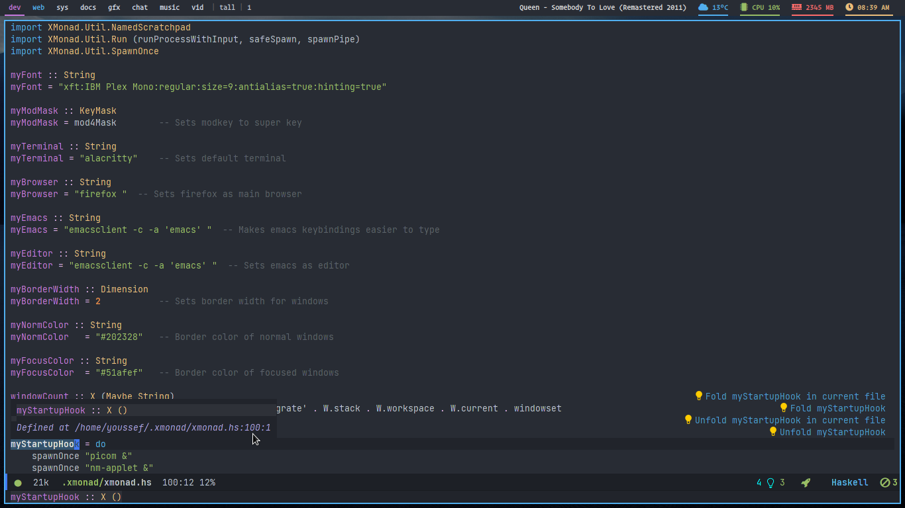
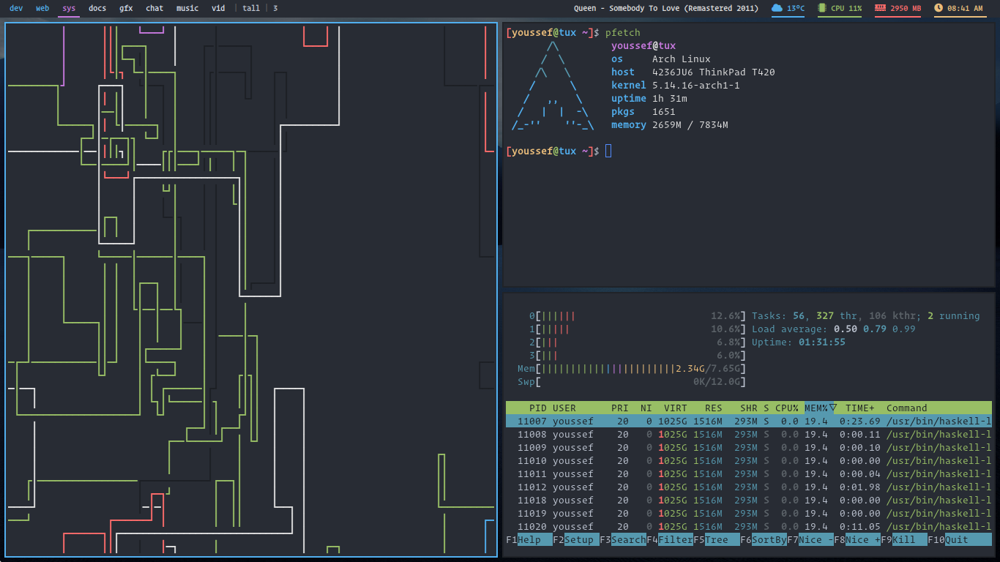

# dotfiles

This repo contains configuration files for the following programs:
- Doom emacs (Editor)
- Xmobar (Panel)
- Xmonad (Window Manager)
- Dunst (Notifications)
- Alacritty (Terminal)
- Zsh (Shell)
the main theme used across these dots is the Doom One theme which is written orginally for doom emacs
> I've written these dotfiles specifically for my Thinkpad T420 Arch linux machine, and although they should work on other machines / Distros, I can't confirm that they will work perfectly with your setup, if you've found something wrong, feel free to file an issue or A pull request !
# Screenshots

